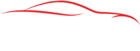

<h1 align="center">
  <br>
  <a href="https://github.com/dtschannen/Tesla-Wrap-Studio"></a>
  <br>
  Tesla Wrap Studio
  <br>
</h1>

<h4 align="center">A professional car wrap design tool for Tesla vehicles built with <a href="https://react.dev" target="_blank">React</a> and <a href="https://konvajs.org" target="_blank">Konva</a>.</h4>

<p align="center">
  <strong>Status:</strong> In development • <strong>Live:</strong> <a href="https://studio.tesla-wrap.com" target="_blank">studio.tesla-wrap.com</a>
</p>

<p align="center">
  <a href="#key-features">Key Features</a> •
  <a href="#supported-models">Supported Models</a> •
  <a href="#how-to-use">How To Use</a> •
  <a href="#tech-stack">Tech Stack</a> •
  <a href="#credits">Credits</a> •
  <a href="#license">License</a>
</p>


Tesla’s 2025 Holiday Update lets owners customize the in-car 3D model with their own wraps. Tesla published the 2D textures in their official repo, but without graphic tooling it’s hard to use. Tesla Wrap Studio makes this easy for everyone—no pro software required—and remains free and open source. See the Tesla assets here: [teslamotors/custom-wraps](https://github.com/teslamotors/custom-wraps). 


## Supported Models

| Model | Variants |
|-------|----------|
| Cybertruck | Standard |
| Model 3 | Standard, 2024+ Base, 2024+ Performance |
| Model Y | Standard, 2025+ Standard, 2025+ Premium, 2025+ Performance, Model Y L |

## How To Use

To clone and run this application, you'll need [Git](https://git-scm.com) and [Node.js](https://nodejs.org/en/download/) (which comes with [npm](http://npmjs.com)) installed on your computer. From your command line:

```bash
# Clone this repository
$ git clone https://github.com/dtschannen/Tesla-Wrap-Studio.git

# Go into the repository
$ cd Tesla-Wrap-Studio

# Install dependencies
$ npm install

# Run the development server
$ npm run dev

# Build for production
$ npm run build
```

## Keyboard Shortcuts

| Shortcut | Action |
|----------|--------|
| `V` | Select tool |
| `B` | Brush tool |
| `E` | Eraser tool |
| `T` | Text tool |
| `U` | Rectangle tool |
| `O` | Circle tool |
| `L` | Line tool |
| `[` / `]` | Decrease/Increase brush size |
| `Ctrl/Cmd + Z` | Undo |
| `Ctrl/Cmd + Y` | Redo |
| `Ctrl/Cmd + +` | Zoom in |
| `Ctrl/Cmd + -` | Zoom out |
| `Ctrl/Cmd + 0` | Fit to screen |
| `Ctrl/Cmd + N` | New project |
| `Delete` | Delete selected layer |
| `Arrow keys` | Nudge selected layer |
| `Shift + Arrow` | Nudge by 10px |

## Tech Stack

This software is built with modern web technologies:

- [React](https://react.dev/) - UI framework
- [TypeScript](https://www.typescriptlang.org/) - Type-safe JavaScript
- [Vite](https://vitejs.dev/) - Build tool and dev server
- [Konva](https://konvajs.org/) / [React-Konva](https://konvajs.org/docs/react/) - 2D canvas rendering
- [Zustand](https://zustand-demo.pmnd.rs/) - State management
- [Tailwind CSS](https://tailwindcss.com/) - Styling
- [dnd-kit](https://dndkit.com/) - Drag and drop


## License

MIT

---

> GitHub [@dtschannen](https://github.com/dtschannen)
> LinkedIn [dtschannen](https://www.linkedin.com/in/dtschannen/)
